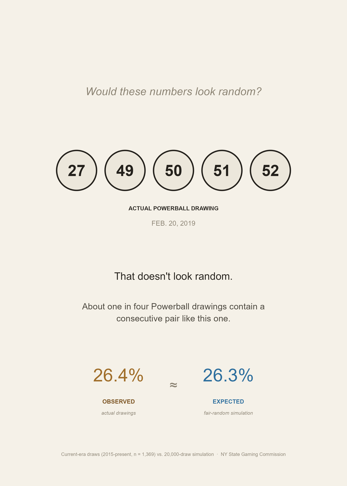
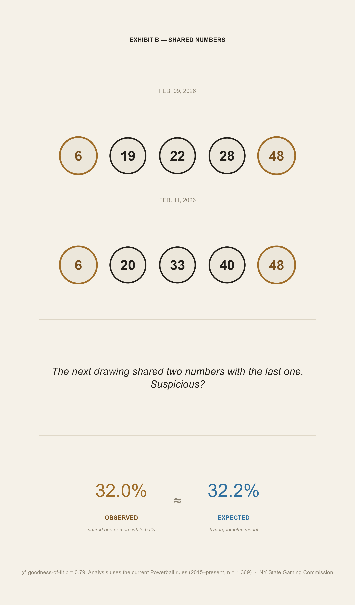
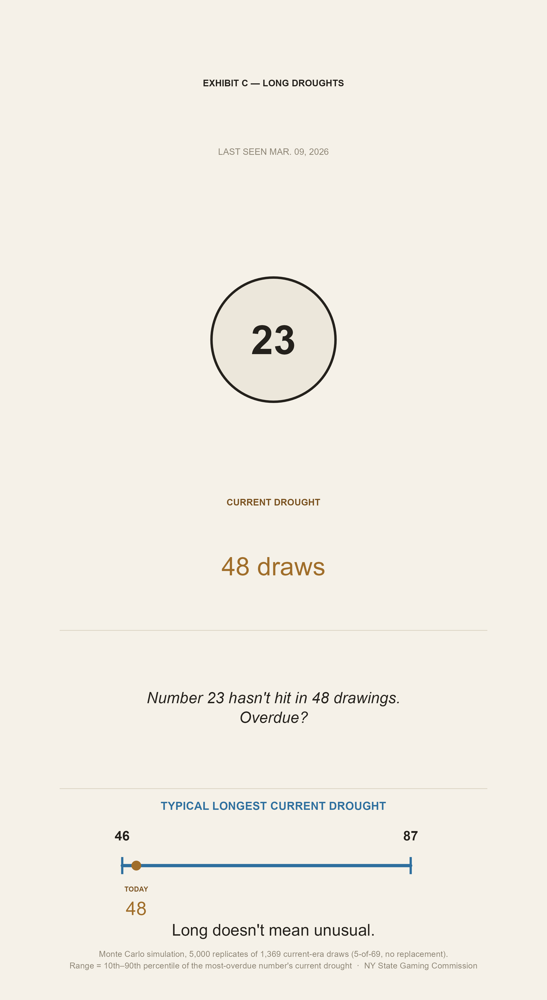

<!--
PHASE 4 — PLAIN STICKY IMPLEMENTATION
=====================================
This version intentionally removes Closeread / Scrollama / cr-active.
The panels are ordinary sticky figures beside minimal exhibit labels.
Editorial copy is preserved from the finalized cold-read draft.
-->

  
THE RANDOMNESS DOCKET

# Does This Look Random to You?

Real Powerball drawings can make ordinary randomness look suspicious. This
piece treats three patterns as exhibits: consecutive numbers, repeated
numbers between drawings, and a number that seems overdue. Each one is
compared with what a fair random process predicts.

<section class="sticky-exhibit" id="exhibit-a">

<strong>Exhibit A.</strong> A single Powerball drawing.

<figure class="exhibit-figure">

</figure>
</section>

<section class="sticky-exhibit" id="exhibit-b">

<strong>Exhibit B.</strong> Two consecutive drawings.

<figure class="exhibit-figure">

</figure>
</section>

<section class="sticky-exhibit" id="exhibit-c">

<strong>Exhibit C.</strong> A number that hasn't appeared in weeks.

<figure class="exhibit-figure">

</figure>
</section>

MECHANISM

Three exhibits, three intuition failures. Here's the property of
randomness that's doing the work behind all of them.

No number in this dataset appears more or less often than chance would
predict. But that stability only shows up over the long run. Early in any
single number's history, its observed rate swings 15 to 300 times more
than it does over the full dataset — small samples are noisy by nature.
As draws accumulate, that swing narrows toward the expected rate.

A consecutive pair, a shared number, a long drought — each looks like
a signal because it's being read in isolation, the way a single early
swing looks like a trend before the sample catches up. Looked at across
the full history, each is part of the texture a fair random process
produces at this sample size.

Randomness isn't the absence of patterns. It's the presence of patterns
that don't mean anything.

<strong>Data source.</strong> NY State Gaming Commission, Powerball Winning Numbers,
2010–present. Current-era statistics (Panels 1–3) use 2015–present draws
only, matching the 2015 white-ball pool-size change.

<strong>Tools.</strong> R, tidyverse, ggplot2. Simulation: 5,000-replicate Monte Carlo,
real draw mechanics (5-of-69, no replacement), seed 20260702.

<!-- licence text carried forward from PDC template — not yet reauthored for this piece -->

Steven Ponce · stevenponce.netlify.app

